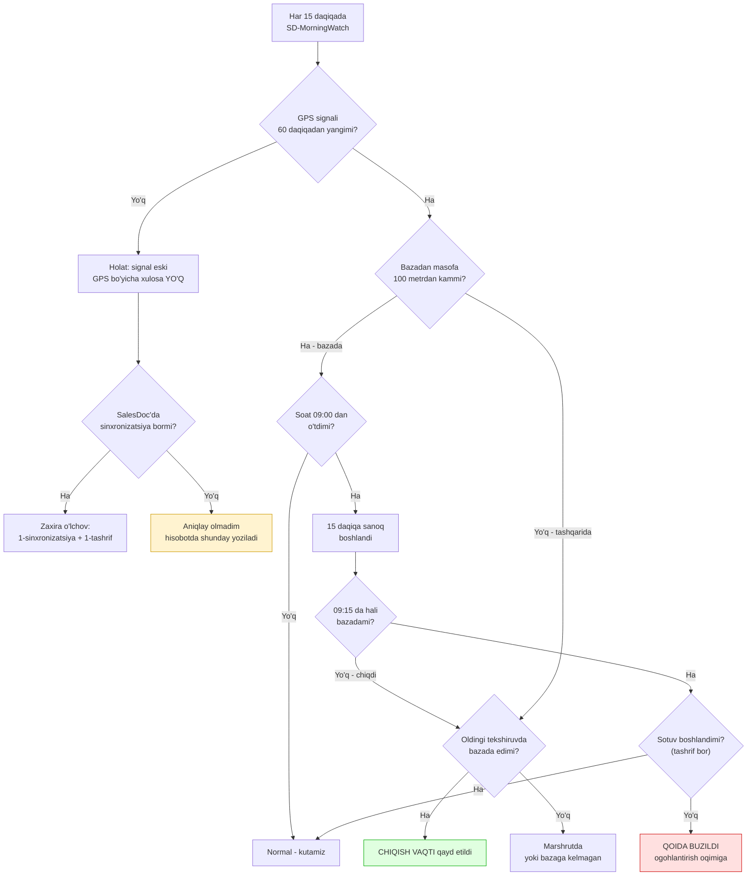
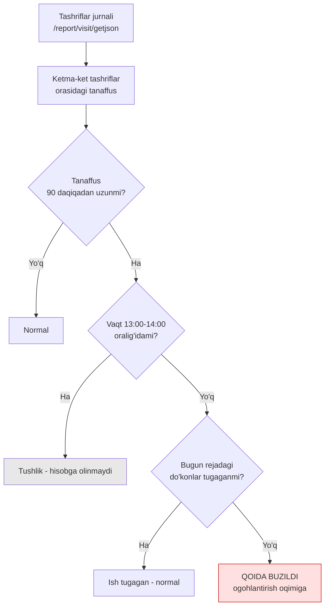
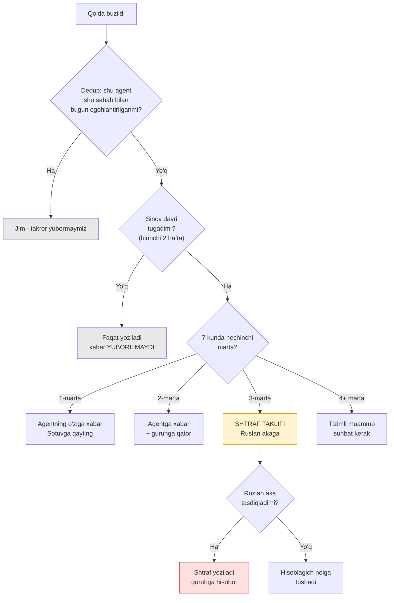
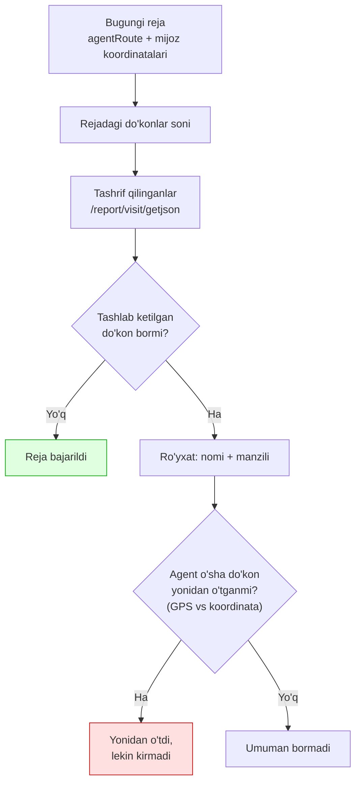

# Audit agenti — qaror daraxti

Bu tizim har bir qadamda qanday qaror qabul qilishini ko'rsatadi.
Manba: [[Audit agenti tizimi]] · [[salesdoc-report-workingTime-itogi-vizitov-manbasi]] · [[salesdoc-kunlik-marshrut-rejasi-va-dokon-koordinatalari]]

---

## 1. Ertalabki chiqish (07:00–12:00, har 15 daqiqa)

---

## 2. Kun ichida yo'qolish

---

## 3. Ogohlantirish va shtraf (7 kunlik oyna)

---

## 4. Marshrut bajarilishi (kun oxiri)

---

## Qaror nuqtalarining sozlamalari

Bularning hammasi `sd-run.mjs` ichidagi `QOIDALAR` blokida, bitta joyda:

| Sozlama | Hozirgi qiymat | Izoh |
|---|---|---|
| Baza radiusi | 100 m | `.env` da `BAZA_RADIUS_M` |
| Chiqish muddati | 09:00 + 15 daq | Ruslan belgilagan |
| Signal eskirish | 60 daqiqa | Undan eski = "aniqlay olmadim" |
| Yo'qolish chegarasi | 90 daqiqa | **Kalibrlash kerak** — hozir juda past |
| Tushlik | 13:00–14:00 | Hisobga olinmaydi |
| Dedup oynasi | 3 kun | Takror xabar to'xtatiladi |
| Shtraf chegarasi | 7 kunda 3 marta | Ruslan tasdig'i bilan |
| Sinov davri | 2 hafta | Bu davrda xabar yuborilmaydi |

> **Diqqat:** 90 daqiqalik chegara hozirgi ma'lumotda 8 kunda 7 ta agentni "3+ marta" ga chiqaradi.
> Sinov davridan keyin qayta kalibrlanadi — maqsad: kuniga 2–3 ta haqiqiy holat, 30 ta emas.
